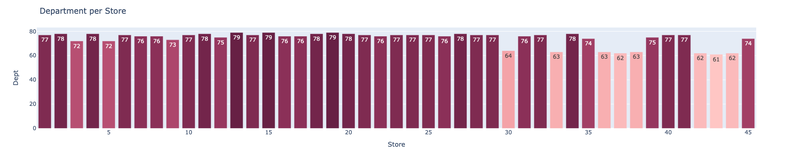
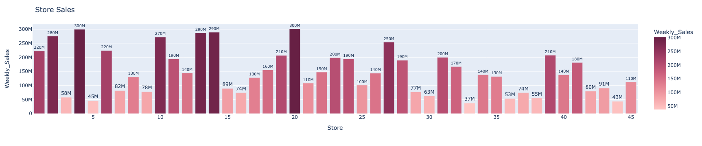
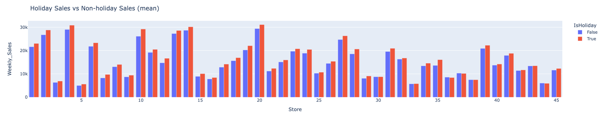
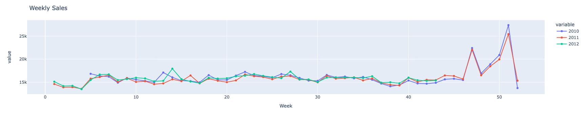
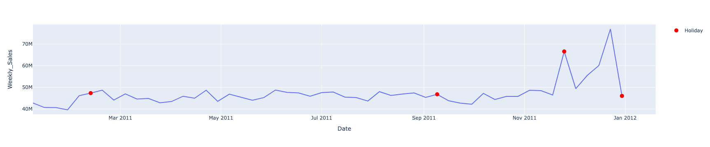
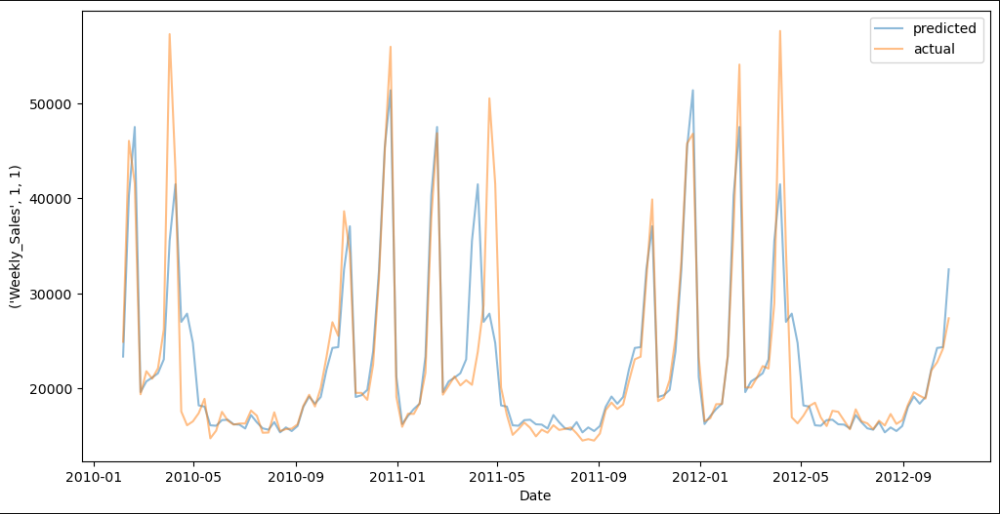

# Walmart Sales Forecasting Analysis

## Goal
The primary objective is to forecast weekly sales for 45 Walmart stores.

**COMPLETE CODE IN THE CODE FOLDER**

## Libraries and Tools Used
- **Pandas**: Data manipulation and analysis.
- **NumPy**: Numerical operations.
- **Matplotlib & Seaborn**: Visualization.
- **Plotly**: Interactive visualizations.
- **Statsmodels**: Statistical models, SARIMAX, CalendarFourier, and DeterministicProcess.
- **XGBoost**: Gradient boosting algorithm.
- **Sklearn**: Machine learning tools and metrics.

## Exploratory Data Analysis (EDA)
1. **Store and Department Overview**:
   - Analyzed the number of departments per store and each store sales.

3. **Holiday Impact**:
   - Compared sales during holidays vs. non-holidays.

## Feature Engineering
1. **Date Features**:
   - Created features such as Week, Month, Quarter, and Year.
   - Identified trends and patterns in sales data, particularly around holidays like Thanksgiving and Christmas.

2. **Holidays**:
   - Created dummy variables for Thanksgiving and Christmas.
   - Added a feature for the week before Christmas due to its significance in sales spikes.

## Forecasting Methods
1. **Moving Average**:
   - Applied a moving average method for forecasting weekly sales.

2. **Linear Regression**:
   - Implemented a linear regression model using `DeterministicProcess` from Statsmodels to capture trends and seasonality.

3. **Model Evaluation**:
   - Calculated the Mean Absolute Error (MAE) to assess model performance.

## Summary
This analysis effectively combined EDA, feature engineering, and various forecasting techniques to predict Walmart's weekly sales, with particular attention paid to holiday impacts and seasonal trends.

